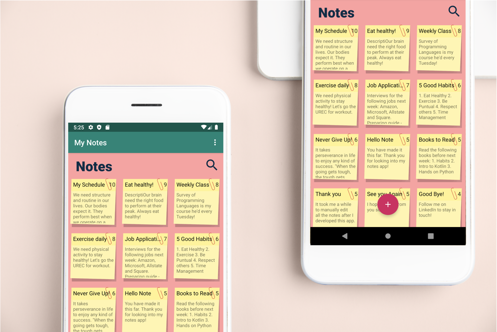

# Sticky-Notes-App

Sticky Notes App is a note taking app that follows MVVM architecture design pattern. It implements the new androidx libraries and stores data locally in SQLite database using Room Persistence library.

Technology Stack:
Java
MVVM
Room
LiveData
ViewModel
ListAdapter for animations on data changes
App supports various database queries & swipe to delete function on the RecyclerView. Utilizes recent ListAdapter library to create animations possible on dataset changes.

Mockkup Designed by: <a href="http://www.freepik.com">Designed by rawpixel.com / Freepik</a>
